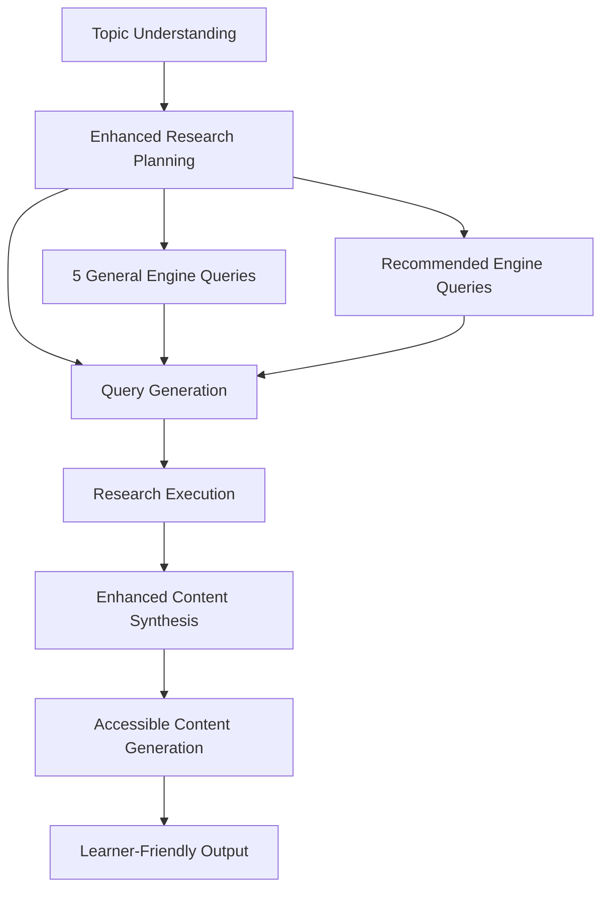

# Design Document

## Overview

This design enhances the AI Learning Agent's content generation system by modifying the research planning strategy and content generation prompts to produce more accessible, learner-friendly content. The solution focuses on balancing academic rigor with practical understanding while ensuring diverse source coverage.

## Architecture

The enhancement involves modifications to two key components in the existing `AILearningAgent` class:

1. **Research Planning Enhancement** - Modify `planResearch()` method to always include general searches
2. **Content Generation Enhancement** - Update content generation prompts and logic to prioritize accessibility

### Component Interaction Flow



## Components and Interfaces

### Enhanced Research Planning Component

**Location:** `AILearningAgent.planResearch()` method

**Responsibilities:**
- Generate research queries combining recommended engines with 5 general engine queries
- Ensure minimum 5 queries using "general" engine are always included
- Create diverse queries for comprehensive coverage using multiple engines

**Interface Changes:**
```typescript
interface EnhancedResearchPlan {
  researchQueries: Array<{
    query: string;
    engine: AgentConfigName;
    reasoning: string;
  }>;
  researchStrategy: string;
  expectedOutcomes: string[];
  engineDistribution: { // NEW: Track engine usage
    general: number; // Always >= 5
    academic: number;
    video: number;
    community: number;
    computational: number;
  };
}
```

### Enhanced Content Generation Component

**Location:** `AILearningAgent.generateContent()` method

**Responsibilities:**
- Generate accessible, learner-friendly content
- Remove user-level customization complexity
- Focus on clear explanations and practical understanding
- Structure content for progressive learning

**Interface Changes:**
```typescript
interface AccessibleContentRequest {
  topic: string;
  synthesis: any;
  // Remove userContext parameter - no longer used for content customization
}

interface EnhancedGeneratedContent extends GeneratedContent {
  readabilityScore: number; // NEW: Track content accessibility
  conceptComplexity: 'simple' | 'moderate' | 'complex'; // NEW: Content complexity indicator
}
```

## Data Models

### Research Query Enhancement

```typescript
interface EnhancedResearchQuery {
  query: string;
  engine: AgentConfigName; // Will include 5+ queries with engine: "general"
  reasoning: string;
  priority: number; // 1-5, with 1 being highest priority
  expectedSourceType: 'practical' | 'academic' | 'mixed';
}
```

### Content Section Enhancement

```typescript
interface AccessibleContentSection {
  title: string;
  content: string;
  sources: string[];
  complexity: 'beginner' | 'intermediate' | 'advanced';
  keyTerms: Array<{ // NEW: Glossary of terms used
    term: string;
    definition: string;
  }>;
  practicalExamples: string[]; // NEW: Real-world examples
}
```

## Error Handling

### Research Planning Errors
- **Fallback Strategy:** If enhanced planning fails, ensure at least 5 queries using "general" engine are created using topic keywords
- **Engine Distribution Validation:** Verify at least 5 general engine queries are included before execution
- **Engine Availability:** Handle cases where recommended engines are unavailable by falling back to general engine

### Content Generation Errors
- **Accessibility Fallback:** If structured generation fails, apply accessibility rules to fallback content
- **Complexity Validation:** Ensure content doesn't exceed moderate complexity levels
- **Content Structure Validation:** Verify logical flow and section organization

## Testing Strategy

### Unit Testing
- Test research planning generates balanced queries
- Verify general queries are always included
- Validate content accessibility metrics
- Test fallback mechanisms for both components

### Integration Testing
- End-to-end content generation with enhanced system
- Source diversity validation in real research scenarios
- Content readability assessment with sample topics

### Manual Testing
- Compare old vs new content output for readability
- Validate learning progression in generated content
- Test with various topic types (technical, cultural, practical)

## Implementation Approach

### Phase 1: Research Planning Enhancement
1. Modify `planResearch()` method to always include 5 queries using "general" engine
2. Update research plan schema and validation to track engine distribution
3. Implement logic to combine recommended engine queries with mandatory general engine queries

### Phase 2: Content Generation Enhancement
1. Update content generation prompts for accessibility
2. Remove user-level customization logic
3. Implement enhanced content structure validation
4. Add readability and complexity tracking

### Phase 3: Integration and Validation
1. Test enhanced system with sample topics
2. Validate content quality improvements
3. Ensure backward compatibility with existing interfaces

## Key Design Decisions

### Decision 1: Always Include 5 General Engine Queries
**Rationale:** Ensures balanced perspective and prevents over-reliance on academic sources by including accessible, general knowledge sources
**Implementation:** Add 5 queries using the "general" engine to every research plan, in addition to any recommended engine queries

### Decision 2: Remove User-Level Content Customization
**Rationale:** Simplifies content generation and focuses on universal accessibility
**Implementation:** Remove userContext parameter from content generation and use fixed accessibility guidelines

### Decision 3: Enhanced Content Structure
**Rationale:** Improves learning progression and content comprehension
**Implementation:** Add complexity tracking, key terms glossary, and practical examples to content sections

### Decision 4: Balanced Source Weighting
**Rationale:** Prioritizes practical understanding while maintaining academic credibility
**Implementation:** Weight general sources equally with academic sources in content synthesis