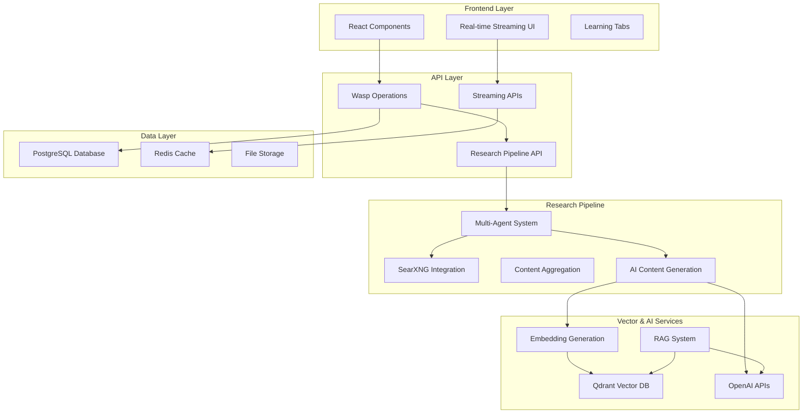

# Design Document

## Overview

This design document outlines the implementation strategy to complete the AI-powered learning research platform by addressing critical missing components and ensuring all features work as specified in the PRD. The design focuses on implementing real SearXNG integration, functional content generation, working RAG system, and proper vector database operations.

## Architecture

### System Architecture Overview



## Components and Interfaces

### 1. SearXNG Integration Layer

#### SearXNG Client Implementation
```typescript
// app/src/learning/research/searxng/client.ts
interface SearxngSearchOptions {
  categories?: string[];
  engines?: string[];
  language?: string;
  pageno?: number;
}

interface SearxngSearchResult {
  title: string;
  url: string;
  img_src?: string;
  thumbnail_src?: string;
  thumbnail?: string;
  content?: string;
  author?: string;
  iframe_src?: string;
}

export class SearxngClient {
  async search(query: string, options?: SearxngSearchOptions): Promise<{
    results: SearxngSearchResult[];
    suggestions: string[];
  }>;
}
```

#### Agent-Specific Search Configurations
```typescript
// app/src/learning/research/searxng/agentConfigs.ts
export const AGENT_SEARCH_CONFIGS = {
  general: { /* no engines - uses default */ },
  academic: { engines: ['arxiv', 'google scholar', 'pubmed'] },
  computational: { engines: ['wolframalpha'] },
  video: { engines: ['youtube'] },
  social: { engines: ['reddit'] }
};
```

### 2. Vector Database Operations

#### Qdrant Integration
```typescript
// app/src/learning/research/vectorStore.ts
export interface VectorStoreConfig {
  qdrantUrl: string;
  collectionName: string;
  vectorSize: number;
  distance: 'Cosine' | 'Euclidean' | 'Dot';
}

export class QdrantVectorStore {
  async createCollection(topicId: string): Promise<void>;
  async storeEmbeddings(documents: VectorDocument[]): Promise<void>;
  async searchSimilar(query: string, topicId: string, limit?: number): Promise<SearchResult[]>;
  async deleteCollection(topicId: string): Promise<void>;
}
```

#### Embedding Generation Service
```typescript
// app/src/learning/research/embeddings.ts
export class EmbeddingService {
  async generateEmbedding(text: string): Promise<number[]>;
  async generateBatchEmbeddings(texts: string[]): Promise<number[][]>;
  async cacheEmbedding(text: string, embedding: number[]): Promise<void>;
  async getCachedEmbedding(text: string): Promise<number[] | null>;
}
```

### 3. Content Generation System

#### AI Content Generator
```typescript
// app/src/learning/api/contentGenerator.ts
export interface ContentGenerationOptions {
  userLevel: 'beginner' | 'intermediate' | 'advanced';
  learningStyle: 'visual' | 'textual' | 'interactive' | 'video' | 'conversational';
  contentType: 'assessment' | 'learning' | 'exploration' | 'quiz';
  maxTokens?: number;
}

export class AIContentGenerator {
  async generateLearningContent(
    topic: Topic,
    researchResults: ResearchResult[],
    options: ContentGenerationOptions
  ): Promise<GeneratedContent>;
  
  async generateAssessmentContent(
    topic: Topic,
    userPreferences: AssessmentResult
  ): Promise<LearningPath>;
  
  async generateExplorationContent(
    topic: Topic,
    subtopics: string[]
  ): Promise<MDXContent>;
}
```

#### Streaming Content Service
```typescript
// app/src/learning/api/streamingService.ts
export class StreamingContentService {
  async streamLearningContent(
    topicId: string,
    userPreferences: any,
    onChunk: (chunk: string) => void,
    onComplete: (content: string) => void,
    onError: (error: Error) => void
  ): Promise<void>;
  
  async streamResearchProgress(
    topicId: string,
    onProgress: (status: ResearchStatus) => void
  ): Promise<void>;
}
```

### 4. Research Pipeline Implementation

#### Multi-Agent Coordinator
```typescript
// app/src/learning/research/coordinator.ts
export class MultiAgentCoordinator {
  async executeParallelResearch(
    topic: string,
    agents: ResearchAgent[],
    onProgress: (agentName: string, progress: number) => void
  ): Promise<AgentCoordinationResult>;
  
  async aggregateResults(
    agentResults: ResearchResult[]
  ): Promise<AggregatedContent>;
  
  async generateSubtopics(
    aggregatedContent: AggregatedContent,
    depth: number
  ): Promise<string[]>;
}
```

#### Real Research Agent Implementation
```typescript
// app/src/learning/research/realAgents.ts
export class RealGeneralResearchAgent extends BaseResearchAgent {
  protected async performSearch(topic: string, context?: any): Promise<SearchResult[]> {
    const searxngClient = new SearxngClient();
    const queries = this.generateOptimizedQueries(topic, context);
    const allResults: SearchResult[] = [];
    
    for (const query of queries) {
      const searchResults = await searxngClient.search(query, {
        // General search - no specific engines
      });
      
      const processedResults = this.processSearchResults(searchResults.results, query);
      allResults.push(...processedResults);
    }
    
    return this.deduplicateAndRank(allResults);
  }
}
```

### 5. RAG System Implementation

#### Vector Operations
```typescript
// app/src/learning/research/vectorOperations.ts
export async function extractRAGContext(
  query: string,
  topicId: string,
  options: {
    maxTokens: number;
    includeMetadata: boolean;
  }
): Promise<{
  context: string;
  sources: SearchResult[];
  totalTokens: number;
}>;

export async function searchTopicContent(
  query: string,
  topicId: string,
  options: {
    limit?: number;
    scoreThreshold?: number;
    contentTypes?: string[];
  }
): Promise<SearchResult[]>;
```

#### Enhanced RAG System
```typescript
// app/src/learning/chat/enhancedRAG.ts
export class EnhancedRAGSystem extends RAGSystem {
  async generateContextualResponse(
    query: string,
    context: ConversationContext,
    vectorStore: QdrantVectorStore
  ): Promise<RAGResponse>;
  
  async optimizePromptForUser(
    basePrompt: string,
    userPreferences: any
  ): Promise<string>;
  
  async generateSmartSuggestions(
    conversation: ConversationMessage[],
    topicContext: string
  ): Promise<string[]>;
}
```

### 6. Real-time Streaming Architecture

#### Server-Sent Events Implementation
```typescript
// app/src/learning/api/streaming.ts
export class StreamingManager {
  private connections: Map<string, Response> = new Map();
  
  async createStream(userId: string, topicId: string): Promise<string>;
  async sendUpdate(streamId: string, data: any): Promise<void>;
  async closeStream(streamId: string): Promise<void>;
  
  async broadcastResearchProgress(
    topicId: string,
    progress: ResearchProgress
  ): Promise<void>;
}
```

#### WebSocket Integration
```typescript
// app/src/learning/realtime/websocketManager.ts
export class WebSocketManager {
  async initializeConnection(userId: string): Promise<WebSocket>;
  async sendRealTimeUpdate(userId: string, update: any): Promise<void>;
  async broadcastToTopic(topicId: string, message: any): Promise<void>;
  async handleDisconnection(userId: string): Promise<void>;
}
```

## Data Models

### Enhanced Vector Document Model
```typescript
interface EnhancedVectorDocument {
  id: string;
  topicId: string;
  content: string;
  embedding: number[];
  metadata: {
    agent: string;
    contentType: 'research' | 'generated' | 'user_note';
    confidence: number;
    sourceUrl?: string;
    timestamp: Date;
    tokens: number;
    language: string;
  };
}
```

### Research Progress Tracking
```typescript
interface ResearchProgress {
  topicId: string;
  status: 'initializing' | 'researching' | 'aggregating' | 'generating' | 'completed' | 'error';
  progress: number; // 0-100
  activeAgents: string[];
  completedAgents: string[];
  currentPhase: string;
  estimatedCompletion?: Date;
  errors: string[];
}
```

### Content Generation State
```typescript
interface ContentGenerationState {
  topicId: string;
  contentType: 'assessment' | 'learning' | 'exploration';
  status: 'pending' | 'generating' | 'streaming' | 'completed' | 'error';
  generatedTokens: number;
  totalEstimatedTokens: number;
  currentSection: string;
  completedSections: string[];
}
```

## Error Handling

### Comprehensive Error Recovery
```typescript
// app/src/learning/errors/recoveryStrategies.ts
export class ErrorRecoveryManager {
  async handleSearxngFailure(error: Error, fallbackStrategy: 'cache' | 'mock' | 'retry'): Promise<SearchResult[]>;
  async handleVectorStoreFailure(error: Error): Promise<void>;
  async handleAIServiceFailure(error: Error, fallbackContent?: string): Promise<string>;
  async handleStreamingFailure(streamId: string, error: Error): Promise<void>;
}
```

### Circuit Breaker Pattern
```typescript
// app/src/learning/errors/circuitBreaker.ts
export class CircuitBreaker {
  private failures: number = 0;
  private lastFailureTime?: Date;
  private state: 'closed' | 'open' | 'half-open' = 'closed';
  
  async execute<T>(operation: () => Promise<T>): Promise<T>;
  private shouldAttempt(): boolean;
  private onSuccess(): void;
  private onFailure(): void;
}
```

## Testing Strategy

### Integration Testing
- SearXNG API integration tests with real and mock responses
- Vector database operations with test collections
- AI service integration with rate limiting and error handling
- Real-time streaming with multiple concurrent connections

### Performance Testing
- Vector search performance with large datasets
- Concurrent research pipeline execution
- Memory usage during long streaming sessions
- Database query optimization under load

### User Experience Testing
- Content generation quality and relevance
- Real-time update responsiveness
- Error message clarity and recovery options
- Cross-browser compatibility for streaming features

## Security Considerations

### API Security
- Rate limiting for AI service calls
- Input validation and sanitization for all user inputs
- Secure storage of API keys and credentials
- Request authentication and authorization

### Data Protection
- Encryption of vector embeddings at rest
- Secure transmission of streaming data
- User data isolation and access controls
- GDPR compliance for user-generated content

## Performance Optimization

### Caching Strategy
- Multi-level caching: Redis for hot data, database for persistent storage
- Embedding cache with TTL based on content freshness
- Search result caching with query normalization
- User session caching for personalization data

### Resource Management
- Connection pooling for database and vector store
- Batch processing for embedding generation
- Lazy loading for large content trees
- Memory management for streaming operations

This design provides a comprehensive foundation for completing the learning platform with all required functionality working properly.