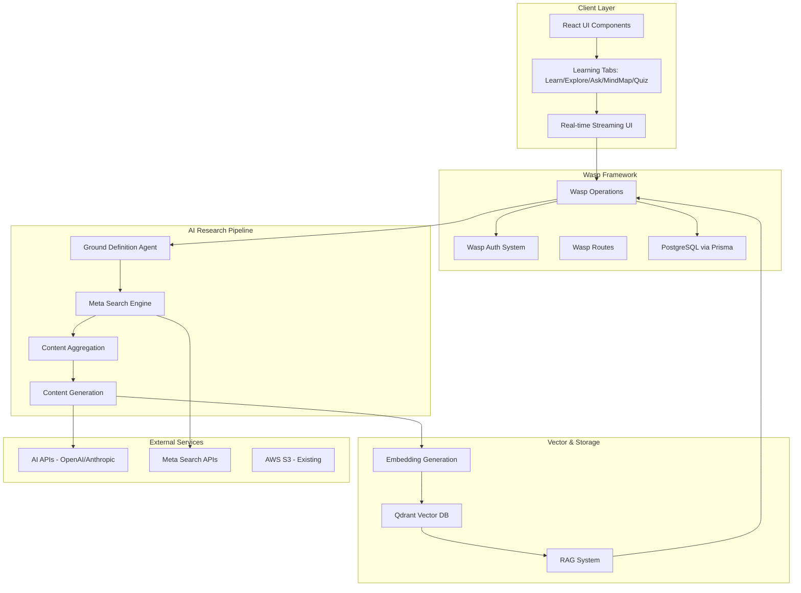

# Design Document

## Overview

The AI-powered learning research platform will be built as an integrated feature within the existing Wasp-based SaaS application. The design leverages Wasp's full-stack capabilities including authentication, database operations, and real-time features while introducing new components for AI-powered research, vector storage, and multi-modal learning interfaces.

The platform follows a microservice-oriented architecture within the Wasp framework, with clear separation between research pipeline, content generation, vector storage, and user interface components.

## Architecture

### High-Level System Architecture



### Data Flow Architecture

1. **Research Initiation**: User enters topic → Ground Definition Agent validates → Search queries generated
2. **Content Aggregation**: Meta search → Results aggregation → AI summarization → Subtopic identification
3. **Recursive Research**: 3-level deep exploration → Content generation → Embedding creation
4. **Storage**: PostgreSQL for structured data → Qdrant for vector embeddings → S3 for media assets
5. **Retrieval**: RAG system queries vectors → Context assembly → AI response generation
6. **UI Updates**: Real-time streaming → Progressive UI updates → State management

## Components and Interfaces

### Core Data Models

#### Extended Prisma Schema
```prisma
// New models to add to existing schema.prisma

model Topic {
  id          String   @id @default(uuid())
  slug        String   @unique
  title       String
  summary     String?
  description String?
  depth       Int      @default(0)
  parentId    String?
  parent      Topic?   @relation("TopicHierarchy", fields: [parentId], references: [id])
  children    Topic[]  @relation("TopicHierarchy")
  status      TopicStatus @default(RESEARCHING)
  metadata    Json?
  createdAt   DateTime @default(now())
  updatedAt   DateTime @updatedAt
  
  // Relations
  userProgress    UserTopicProgress[]
  chatThreads     ChatThread[]
  quizzes         Quiz[]
  vectorDocuments VectorDocument[]
  
  @@index([slug])
  @@index([parentId])
}

model UserTopicProgress {
  id           String   @id @default(uuid())
  userId       String
  topicId      String
  completed    Boolean  @default(false)
  timeSpent    Int      @default(0) // in seconds
  lastAccessed DateTime @default(now())
  preferences  Json?    // learning style, knowledge level
  bookmarks    String[] // array of content IDs
  
  user         User     @relation(fields: [userId], references: [id])
  topic        Topic    @relation(fields: [topicId], references: [id])
  
  @@unique([userId, topicId])
  @@index([userId])
  @@index([topicId])
}

model ChatThread {
  id        String    @id @default(uuid())
  userId    String
  topicId   String
  title     String?
  messages  Message[]
  createdAt DateTime  @default(now())
  updatedAt DateTime  @updatedAt
  
  user      User      @relation(fields: [userId], references: [id])
  topic     Topic     @relation(fields: [topicId], references: [id])
  
  @@index([userId])
  @@index([topicId])
}

model Message {
  id           String     @id @default(uuid())
  threadId     String
  role         MessageRole
  content      String
  metadata     Json?
  createdAt    DateTime   @default(now())
  
  thread       ChatThread @relation(fields: [threadId], references: [id], onDelete: Cascade)
  
  @@index([threadId])
}

model Quiz {
  id          String        @id @default(uuid())
  topicId     String
  userId      String
  title       String
  questions   QuizQuestion[]
  score       Float?
  completed   Boolean       @default(false)
  completedAt DateTime?
  createdAt   DateTime      @default(now())
  
  topic       Topic         @relation(fields: [topicId], references: [id])
  user        User          @relation(fields: [userId], references: [id])
  
  @@index([userId])
  @@index([topicId])
}

model QuizQuestion {
  id          String      @id @default(uuid())
  quizId      String
  question    String
  type        QuestionType
  options     String[]    // JSON array for multiple choice
  correctAnswer String
  explanation String?
  userAnswer  String?
  isCorrect   Boolean?
  
  quiz        Quiz        @relation(fields: [quizId], references: [id], onDelete: Cascade)
  
  @@index([quizId])
}

model VectorDocument {
  id          String   @id @default(uuid())
  topicId     String
  content     String
  embedding   String   // JSON serialized vector
  metadata    Json
  createdAt   DateTime @default(now())
  
  topic       Topic    @relation(fields: [topicId], references: [id])
  
  @@index([topicId])
}

// Enums
enum TopicStatus {
  RESEARCHING
  COMPLETED
  ERROR
  PENDING
}

enum MessageRole {
  USER
  ASSISTANT
  SYSTEM
}

enum QuestionType {
  MULTIPLE_CHOICE
  TRUE_FALSE
  FILL_BLANK
  CODE_CHALLENGE
}

// Extend existing User model
model User {
  // ... existing fields ...
  
  // New relations for learning platform
  topicProgress   UserTopicProgress[]
  chatThreads     ChatThread[]
  quizzes         Quiz[]
}
```

### Wasp Operations

#### Topic Research Operations
```wasp
// Add to main.wasp

//#region Learning Research Platform

// Topic Management
action createTopic {
  fn: import { createTopic } from "@src/learning/operations",
  entities: [User, Topic, VectorDocument]
}

query getTopic {
  fn: import { getTopic } from "@src/learning/operations",
  entities: [Topic, UserTopicProgress]
}

query getTopicTree {
  fn: import { getTopicTree } from "@src/learning/operations",
  entities: [Topic]
}

action updateTopicProgress {
  fn: import { updateTopicProgress } from "@src/learning/operations",
  entities: [User, UserTopicProgress]
}

// Chat Operations
action createChatThread {
  fn: import { createChatThread } from "@src/learning/chat/operations",
  entities: [User, Topic, ChatThread]
}

action sendMessage {
  fn: import { sendMessage } from "@src/learning/chat/operations",
  entities: [ChatThread, Message, VectorDocument]
}

query getChatThreads {
  fn: import { getChatThreads } from "@src/learning/chat/operations",
  entities: [ChatThread, Message]
}

// Quiz Operations
action generateQuiz {
  fn: import { generateQuiz } from "@src/learning/quiz/operations",
  entities: [User, Topic, Quiz, QuizQuestion, UserTopicProgress]
}

action submitQuizAnswer {
  fn: import { submitQuizAnswer } from "@src/learning/quiz/operations",
  entities: [Quiz, QuizQuestion]
}

query getUserQuizzes {
  fn: import { getUserQuizzes } from "@src/learning/quiz/operations",
  entities: [Quiz, QuizQuestion]
}

// Research Pipeline API
api researchTopic {
  fn: import { researchTopicHandler } from "@src/learning/research/api",
  entities: [Topic, VectorDocument],
  httpRoute: (POST, "/api/research")
}

// Routes and Pages
route TopicRoute { path: "/learn/:slug", to: TopicPage }
page TopicPage {
  authRequired: true,
  component: import TopicPage from "@src/learning/TopicPage"
}

route TopicSearchRoute { path: "/learn", to: TopicSearchPage }
page TopicSearchPage {
  authRequired: true,
  component: import TopicSearchPage from "@src/learning/TopicSearchPage"
}

//#endregion
```

### Component Architecture

#### Frontend Component Structure
```
src/learning/
├── TopicPage.tsx                 # Main topic learning interface
├── TopicSearchPage.tsx           # Topic search and creation
├── components/
│   ├── tabs/
│   │   ├── LearnTab.tsx         # Guided learning interface
│   │   ├── ExploreTab.tsx       # Tree navigation and content
│   │   ├── AskTab.tsx           # Chat interface
│   │   ├── MindMapTab.tsx       # React Flow visualization
│   │   └── QuizTab.tsx          # Quiz interface
│   ├── ui/
│   │   ├── TopicTree.tsx        # Hierarchical navigation
│   │   ├── ProgressIndicator.tsx # Progress tracking
│   │   ├── StreamingContent.tsx  # Real-time content display
│   │   └── KnowledgeAssessment.tsx # Initial assessment
│   └── research/
│       ├── ResearchStatus.tsx    # Research progress display
│       └── ContentGenerator.tsx  # Content streaming component
├── hooks/
│   ├── useTopicResearch.ts      # Research pipeline hook
│   ├── useStreamingContent.ts   # Real-time content streaming
│   ├── useVectorSearch.ts       # RAG search hook
│   └── useTopicProgress.ts      # Progress tracking
├── research/
│   ├── api.ts                   # Research API handlers
│   ├── pipeline.ts              # Research pipeline logic
│   ├── agents.ts                # AI agent implementations
│   └── vectorStore.ts           # Qdrant integration
├── chat/
│   ├── operations.ts            # Chat-related operations
│   └── ragSystem.ts             # RAG implementation
└── quiz/
    ├── operations.ts            # Quiz operations
    └── generator.ts             # Quiz generation logic
```

## Data Models

### Topic Hierarchy Model
- **Root Topics**: User-initiated research topics (depth 0)
- **Subtopics**: AI-identified related concepts (depth 1-3)
- **Expandable**: On-demand research for deeper levels
- **Metadata**: Research status, content quality, user engagement

### Vector Storage Model
- **Document Chunks**: Semantic chunks of generated content
- **Embeddings**: OpenAI text-embedding-3-small vectors
- **Metadata**: Topic hierarchy, content type, creation timestamp
- **Collections**: Organized by root topic for efficient retrieval

### User Progress Model
- **Completion Tracking**: Per-topic and per-subtopic progress
- **Time Analytics**: Learning session duration and patterns
- **Preferences**: Learning style, knowledge level, bookmarks
- **Achievement System**: Badges, streaks, completion certificates

## Error Handling

### Research Pipeline Errors
- **Search API Failures**: Graceful degradation with cached results
- **AI Generation Errors**: Retry logic with exponential backoff
- **Vector Storage Errors**: Fallback to database-only storage
- **Rate Limiting**: Queue management for API calls

### User Experience Errors
- **Network Failures**: Offline mode with cached content
- **Authentication Errors**: Seamless re-authentication flow
- **Content Loading**: Progressive loading with skeleton states
- **Real-time Failures**: Fallback to polling mechanisms

### Data Consistency
- **Transaction Management**: Atomic operations for complex updates
- **Conflict Resolution**: Optimistic locking for concurrent edits
- **Backup Strategies**: Regular snapshots of vector embeddings
- **Migration Support**: Schema evolution for model updates

## Testing Strategy

### Unit Testing
- **Research Pipeline**: Mock AI APIs and search engines
- **Vector Operations**: Test embedding generation and retrieval
- **UI Components**: React Testing Library for component behavior
- **Database Operations**: Prisma test database with fixtures

### Integration Testing
- **End-to-End Research**: Full pipeline from query to content
- **Real-time Features**: WebSocket connection testing
- **Authentication Flow**: User journey through learning features
- **Cross-tab Functionality**: State synchronization testing

### Performance Testing
- **Vector Search**: Query performance with large datasets
- **Real-time Streaming**: Concurrent user load testing
- **Memory Usage**: Long-running research session monitoring
- **Database Performance**: Query optimization and indexing

### User Acceptance Testing
- **Learning Effectiveness**: Content quality and comprehension
- **Interface Usability**: Multi-modal learning experience
- **Accessibility**: Screen reader and keyboard navigation
- **Mobile Responsiveness**: Touch interface optimization

## Security Considerations

### Data Protection
- **API Keys**: Secure storage and rotation of AI service credentials
- **Vector Data**: Access control for embedding storage

### Access Control
- **Topic Ownership**: User-scoped access to research topics
- **Admin Capabilities**: Enhanced features for admin users
- **Rate Limiting**: Per-user limits on AI API usage
- **Subscription Enforcement**: Feature gating based on payment status

### AI Safety
- **Content Filtering**: Inappropriate content detection and blocking
- **Bias Mitigation**: Diverse source aggregation and fact-checking
- **Hallucination Detection**: Cross-reference validation for AI responses
- **User Reporting**: Community-driven content quality control

## Performance Optimization

### Caching Strategy
- **Vector Caching**: In-memory cache for recent embeddings
- **Static Asset CDN**: Optimized delivery of learning materials

### Database Optimization
- **Indexing Strategy**: Optimized queries for topic hierarchy
- **Connection Pooling**: Efficient database connection management
- **Query Optimization**: Minimize N+1 queries in topic trees
- **Pagination**: Efficient handling of large content sets

### Real-time Performance
- **WebSocket Optimization**: Efficient message broadcasting
- **Streaming Optimization**: Chunked content delivery
- **Client-side Caching**: Reduce server requests for static content
- **Progressive Loading**: Prioritize above-the-fold content

This design provides a comprehensive foundation for building the AI-powered learning research platform while leveraging the existing Wasp infrastructure and maintaining scalability, security, and user experience standards.