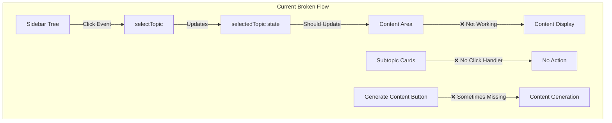
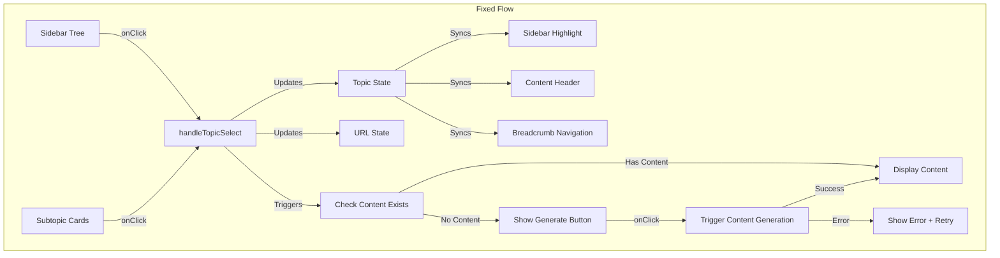

# Design Document

## Overview

This design document outlines the solution to fix the subtopic navigation issues in the learning platform's Explore tab. The main problems identified are:

1. Subtopic selection in the sidebar tree doesn't update the content area
2. Subtopic cards at the bottom of content are not clickable/functional
3. Content generation for subtopics is not properly triggered
4. State management between sidebar and content area is inconsistent
5. URL routing doesn't reflect subtopic selection

The solution involves fixing the state management flow, implementing proper event handlers, and ensuring consistent data flow between components.

## Architecture

### Current Architecture Issues



### Fixed Architecture Flow



## Components and Interfaces

### 1. Enhanced Topic Selection Handler

```typescript
// app/src/learning/hooks/useTopicNavigation.ts
interface TopicNavigationState {
  selectedTopic: TopicTreeItem | null;
  selectedSubtopic: TopicTreeItem | null;
  contentPath: string[];
  isGeneratingContent: boolean;
  navigationHistory: TopicTreeItem[];
}

interface UseTopicNavigationReturn {
  // State
  selectedTopic: TopicTreeItem | null;
  selectedSubtopic: TopicTreeItem | null;
  contentPath: string[];
  isGeneratingContent: boolean;
  
  // Actions
  selectTopic: (topic: TopicTreeItem) => void;
  selectSubtopic: (subtopic: TopicTreeItem) => void;
  navigateToPath: (path: string[]) => void;
  generateContentForTopic: (topic: TopicTreeItem) => Promise<void>;
  
  // Utilities
  getTopicByPath: (path: string[]) => TopicTreeItem | null;
  isTopicSelected: (topicId: string) => boolean;
  getNavigationBreadcrumbs: () => { title: string; path: string[] }[];
}

export function useTopicNavigation(
  topics: TopicTreeItem[],
  initialPath?: string[]
): UseTopicNavigationReturn;
```

### 2. Fixed ExploreTab Component Structure

```typescript
// app/src/learning/components/tabs/ExploreTab.tsx
interface ExploreTabState {
  // Navigation state
  selectedTopicPath: string[];
  expandedNodes: Set<string>;
  
  // Content state
  topicContent: Map<string, string>;
  contentSources: Map<string, SourceAttribution[]>;
  generatingContent: Set<string>;
  
  // UI state
  sidebarCollapsed: boolean;
  activeTab: 'tree' | 'bookmarks' | 'recent';
}

// Key methods to implement
const handleTopicSelect = (topic: TopicTreeItem) => {
  // Update selected topic state
  // Update URL to reflect selection
  // Trigger content loading/generation if needed
  // Update sidebar highlighting
  // Add to navigation history
};

const handleSubtopicCardClick = (subtopic: TopicTreeItem) => {
  // Same as handleTopicSelect but with additional context
  // Ensure parent topic remains in context
  // Update breadcrumb navigation
};

const generateContentForSelectedTopic = async () => {
  // Generate content for currently selected topic
  // Update loading states
  // Handle errors gracefully
  // Cache generated content
};
```

### 3. Enhanced TopicTree Component

```typescript
// app/src/learning/components/ui/TopicTree.tsx
interface EnhancedTopicTreeProps {
  topics: TopicTreeItem[];
  selectedTopicPath: string[]; // Changed from selectedTopicId to path
  onTopicSelect: (topic: TopicTreeItem, path: string[]) => void;
  onGenerateSubtopics?: (topicId: string) => void;
  expandedNodes: Set<string>;
  onToggleExpand: (topicId: string) => void;
  isGenerating?: boolean;
  searchQuery?: string;
  onSearchChange?: (query: string) => void;
  compact?: boolean;
}

// Enhanced TopicNode with proper path tracking
interface TopicNodeProps {
  topic: TopicTreeItem;
  path: string[]; // Full path to this topic
  level: number;
  isSelected: boolean;
  isExpanded: boolean;
  expandedNodes: Set<string>;
  onToggleExpand: (topicId: string) => void;
  onSelect: (topic: TopicTreeItem, path: string[]) => void;
  onGenerateSubtopics?: (topicId: string) => void;
  isGenerating?: boolean;
  searchQuery?: string;
}
```

### 4. Clickable Subtopic Cards Component

```typescript
// app/src/learning/components/ui/SubtopicCards.tsx
interface SubtopicCard {
  id: string;
  title: string;
  description: string;
  complexity: 'beginner' | 'intermediate' | 'advanced';
  priority: number;
  estimatedReadTime: number;
  hasContent: boolean;
  topic: TopicTreeItem; // Full topic object for navigation
}

interface SubtopicCardsProps {
  subtopics: SubtopicCard[];
  onSubtopicClick: (subtopic: TopicTreeItem) => void;
  selectedSubtopicId?: string;
  isGeneratingContent?: boolean;
}

export function SubtopicCards({
  subtopics,
  onSubtopicClick,
  selectedSubtopicId,
  isGeneratingContent
}: SubtopicCardsProps) {
  return (
    <div className="grid grid-cols-1 md:grid-cols-2 lg:grid-cols-3 gap-4">
      {subtopics.map((subtopic) => (
        <Card 
          key={subtopic.id} 
          className={`cursor-pointer hover:shadow-md transition-all ${
            selectedSubtopicId === subtopic.id ? 'ring-2 ring-primary' : ''
          }`}
          onClick={() => onSubtopicClick(subtopic.topic)}
        >
          <CardContent className="p-4">
            <div className="flex items-start justify-between">
              <div className="flex-1">
                <h3 className="font-medium text-sm">{subtopic.title}</h3>
                <p className="text-xs text-muted-foreground mt-1 line-clamp-2">
                  {subtopic.description}
                </p>
              </div>
              <div className="ml-2 flex-shrink-0">
                <span className={`inline-flex items-center px-2 py-1 rounded-full text-xs ${
                  subtopic.complexity === 'beginner' ? 'bg-green-100 text-green-800' :
                  subtopic.complexity === 'intermediate' ? 'bg-yellow-100 text-yellow-800' :
                  'bg-red-100 text-red-800'
                }`}>
                  {subtopic.complexity}
                </span>
              </div>
            </div>
            <div className="mt-3 flex items-center justify-between text-xs text-muted-foreground">
              <span>Priority: {subtopic.priority}</span>
              <span>{subtopic.estimatedReadTime}min read</span>
            </div>
            {!subtopic.hasContent && (
              <div className="mt-2 text-xs text-blue-600 bg-blue-50 px-2 py-1 rounded">
                Click to generate content
              </div>
            )}
          </CardContent>
        </Card>
      ))}
    </div>
  );
}
```

### 5. Enhanced Content Display with Navigation

```typescript
// app/src/learning/components/ui/ContentDisplay.tsx
interface ContentDisplayProps {
  topic: TopicTreeItem;
  content: string;
  sources: SourceAttribution[];
  subtopics: SubtopicCard[];
  isGenerating: boolean;
  onSubtopicClick: (subtopic: TopicTreeItem) => void;
  onGenerateContent: () => void;
  navigationPath: { title: string; path: string[] }[];
  onNavigateToPath: (path: string[]) => void;
}

export function ContentDisplay({
  topic,
  content,
  sources,
  subtopics,
  isGenerating,
  onSubtopicClick,
  onGenerateContent,
  navigationPath,
  onNavigateToPath
}: ContentDisplayProps) {
  return (
    <div className="space-y-6">
      {/* Navigation Breadcrumbs */}
      <nav className="flex items-center space-x-2 text-sm text-muted-foreground">
        {navigationPath.map((crumb, index) => (
          <React.Fragment key={index}>
            {index > 0 && <ChevronRight className="w-4 h-4" />}
            <button
              onClick={() => onNavigateToPath(crumb.path)}
              className="hover:text-foreground transition-colors"
            >
              {crumb.title}
            </button>
          </React.Fragment>
        ))}
      </nav>

      {/* Content Header */}
      <div className="border-b pb-4">
        <h1 className="text-2xl font-bold">{topic.title}</h1>
        {topic.summary && (
          <p className="text-muted-foreground mt-2">{topic.summary}</p>
        )}
      </div>

      {/* Main Content */}
      {content ? (
        <MDXContent
          content={content}
          topicTitle={topic.title}
          sources={sources}
        />
      ) : (
        <ContentPlaceholder
          topic={topic}
          onGenerateContent={onGenerateContent}
          isGenerating={isGenerating}
        />
      )}

      {/* Subtopic Cards */}
      {subtopics.length > 0 && (
        <div className="mt-8 border-t pt-6">
          <h2 className="text-xl font-semibold mb-4">Explore Further</h2>
          <SubtopicCards
            subtopics={subtopics}
            onSubtopicClick={onSubtopicClick}
            isGeneratingContent={isGenerating}
          />
        </div>
      )}
    </div>
  );
}
```

## Data Models

### Enhanced Topic Navigation State

```typescript
interface TopicNavigationState {
  // Current selection
  selectedTopicPath: string[];
  selectedTopic: TopicTreeItem | null;
  
  // Content management
  topicContent: Map<string, {
    content: string;
    sources: SourceAttribution[];
    generatedAt: Date;
    cached: boolean;
  }>;
  
  // UI state
  expandedNodes: Set<string>;
  generatingContent: Set<string>;
  navigationHistory: {
    topic: TopicTreeItem;
    timestamp: Date;
    path: string[];
  }[];
  
  // Error handling
  errors: Map<string, {
    message: string;
    timestamp: Date;
    retryCount: number;
  }>;
}
```

### URL State Management

```typescript
interface URLState {
  topicSlug: string;
  subtopicPath?: string[];
  tab: string;
}

// URL format: /learn/{topicSlug}?subtopic=path1,path2,path3&tab=explore
const parseURLState = (url: string): URLState => {
  // Parse URL and extract topic and subtopic information
};

const buildURL = (state: URLState): string => {
  // Build URL from state
};
```

## Error Handling

### Comprehensive Error Recovery

```typescript
// app/src/learning/hooks/useTopicErrorHandler.ts
interface TopicError {
  type: 'selection' | 'content_generation' | 'navigation' | 'api';
  message: string;
  topicId?: string;
  retryable: boolean;
  timestamp: Date;
}

interface UseTopicErrorHandlerReturn {
  errors: TopicError[];
  hasError: (topicId?: string) => boolean;
  getError: (topicId?: string) => TopicError | null;
  clearError: (topicId?: string) => void;
  handleError: (error: Error, context: { type: TopicError['type']; topicId?: string }) => void;
  retryOperation: (topicId: string, operation: () => Promise<void>) => Promise<void>;
}

export function useTopicErrorHandler(): UseTopicErrorHandlerReturn {
  const [errors, setErrors] = useState<TopicError[]>([]);
  
  const handleError = useCallback((error: Error, context: { type: TopicError['type']; topicId?: string }) => {
    const topicError: TopicError = {
      type: context.type,
      message: error.message,
      topicId: context.topicId,
      retryable: isRetryableError(error),
      timestamp: new Date()
    };
    
    setErrors(prev => [...prev.filter(e => e.topicId !== context.topicId), topicError]);
    
    // Log error for debugging
    console.error(`Topic ${context.type} error:`, error);
  }, []);
  
  const retryOperation = useCallback(async (topicId: string, operation: () => Promise<void>) => {
    try {
      clearError(topicId);
      await operation();
    } catch (error) {
      handleError(error as Error, { type: 'api', topicId });
      throw error;
    }
  }, []);
  
  // ... other methods
  
  return {
    errors,
    hasError,
    getError,
    clearError,
    handleError,
    retryOperation
  };
}
```

## Testing Strategy

### Component Testing
- Test subtopic selection in sidebar updates content area
- Test subtopic card clicks navigate properly
- Test content generation triggers correctly
- Test error states and recovery mechanisms
- Test URL state synchronization

### Integration Testing
- Test complete navigation flow from main topic to subtopics
- Test content generation and caching
- Test error handling across component boundaries
- Test browser navigation (back/forward buttons)
- Test deep linking to specific subtopics

### User Experience Testing
- Test navigation responsiveness and feedback
- Test loading states and progress indicators
- Test error messages and recovery options
- Test accessibility of navigation elements
- Test mobile responsiveness of navigation

## Performance Optimization

### Caching Strategy
```typescript
// app/src/learning/cache/topicContentCache.ts
interface ContentCacheEntry {
  content: string;
  sources: SourceAttribution[];
  generatedAt: Date;
  accessCount: number;
  lastAccessed: Date;
}

class TopicContentCache {
  private cache = new Map<string, ContentCacheEntry>();
  private maxSize = 50; // Maximum cached topics
  
  get(topicId: string): ContentCacheEntry | null {
    const entry = this.cache.get(topicId);
    if (entry) {
      entry.lastAccessed = new Date();
      entry.accessCount++;
    }
    return entry || null;
  }
  
  set(topicId: string, content: string, sources: SourceAttribution[]): void {
    // Implement LRU eviction if cache is full
    if (this.cache.size >= this.maxSize) {
      this.evictLeastRecentlyUsed();
    }
    
    this.cache.set(topicId, {
      content,
      sources,
      generatedAt: new Date(),
      accessCount: 1,
      lastAccessed: new Date()
    });
  }
  
  private evictLeastRecentlyUsed(): void {
    let oldestEntry: [string, ContentCacheEntry] | null = null;
    
    for (const [key, entry] of this.cache.entries()) {
      if (!oldestEntry || entry.lastAccessed < oldestEntry[1].lastAccessed) {
        oldestEntry = [key, entry];
      }
    }
    
    if (oldestEntry) {
      this.cache.delete(oldestEntry[0]);
    }
  }
}
```

### State Management Optimization
- Use React.memo for expensive components
- Implement proper dependency arrays in useEffect hooks
- Use useCallback for event handlers to prevent unnecessary re-renders
- Implement virtual scrolling for large topic trees
- Debounce search and filter operations

This design provides a comprehensive solution to fix the subtopic navigation issues while maintaining good performance and user experience.